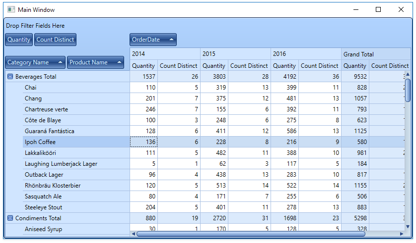

<!-- default file list -->
*Files to look at*:

* [MainWindow.xaml](./CS/DXPivotGrid_CustomSummary/MainWindow.xaml) (VB: [MainWindow.xaml](./VB/DXPivotGrid_CustomSummary/MainWindow.xaml))
* [MainWindow.xaml.cs](./CS/DXPivotGrid_CustomSummary/MainWindow.xaml.cs) (VB: [MainWindow.xaml](./VB/DXPivotGrid_CustomSummary/MainWindow.xaml))
<!-- default file list end -->
# How to Create a Custom Summary Type to Display the Distinct Value Count

This example demonstrates how to count distinct values (the number of orders with equal product quantities) and display the result in the pivot grid.

This example handles the [PivotGridControl.CustomSummary](https://docs.devexpress.com/WPF/DevExpress.Xpf.PivotGrid.PivotGridControl.CustomSummary) event that occurs when the control calculates a summary for a field whose [SummaryType](https://docs.devexpress.com/CoreLibraries/DevExpress.XtraPivotGrid.PivotGridFieldBase.SummaryType) is [PivotSummaryType.Custom](https://docs.devexpress.com/CoreLibraries/DevExpress.Data.PivotGrid.PivotSummaryType). The event handler calls the [e.CreateDrillDownDataSource](https://docs.devexpress.com/CoreLibraries/DevExpress.XtraPivotGrid.Data.PivotGridCustomSummaryEventArgsBase-1.CreateDrillDownDataSource) method to retrieve the underlying data rows for the current cell, counts distinct values and returns the result to the [e.CustomValue](https://docs.devexpress.com/CoreLibraries/DevExpress.XtraPivotGrid.Data.PivotGridCustomSummaryEventArgsBase-1.CustomValue) property.

API in this example:

* [PivotGridControl.CustomSummary](https://docs.devexpress.com/WPF/DevExpress.Xpf.PivotGrid.PivotGridControl.CustomSummary) event
* [PivotGridField.SummaryType](https://docs.devexpress.com/CoreLibraries/DevExpress.XtraPivotGrid.PivotGridFieldBase.SummaryType) property
* [PivotGridCustomSummaryEventArgs.CreateDrillDownDataSource](https://docs.devexpress.com/CoreLibraries/DevExpress.XtraPivotGrid.Data.PivotGridCustomSummaryEventArgsBase-1.CreateDrillDownDataSource) method
* [PivotDrillDownDataRow](https://docs.devexpress.com/CoreLibraries/DevExpress.XtraPivotGrid.PivotDrillDownDataRow) class
* [PivotGridCustomSummaryEventArgs.CustomValue](https://docs.devexpress.com/CoreLibraries/DevExpress.XtraPivotGrid.Data.PivotGridCustomSummaryEventArgsBase-1.CustomValue) property
* [ExcelDataSource](https://docs.devexpress.com/CoreLibraries/DevExpress.DataAccess.Excel.ExcelDataSource) class

**See also:**

* [Aggregation](https://docs.devexpress.com/WPF/11732)
* [Pivot Grid Expression Syntax](https://docs.devexpress.com/CoreLibraries/120512)
* [Unbound Fields](https://docs.devexpress.com/WindowsForms/8025)

Examples for other platforms:
* [WinForms -  How to Create a Custom Summary Type to Display the Distinct Value Count](https://github.com/DevExpress-Examples/how-to-implement-the-distinct-count-summary-type-within-the-pivotgrid-e637)
